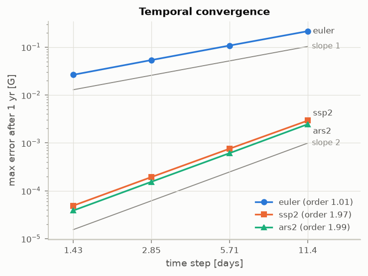
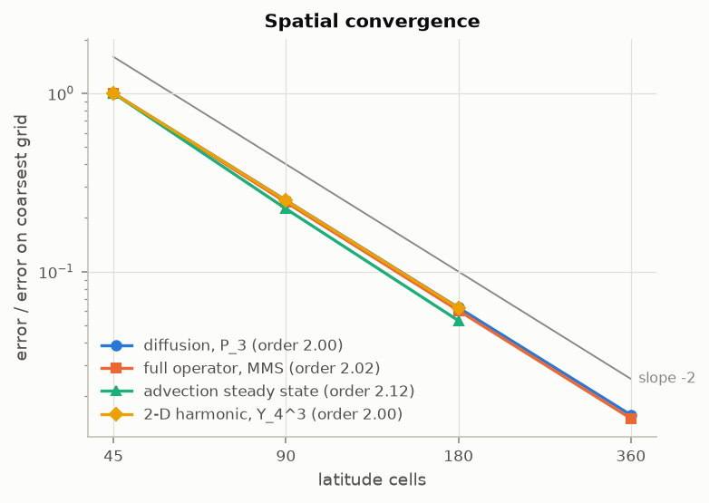
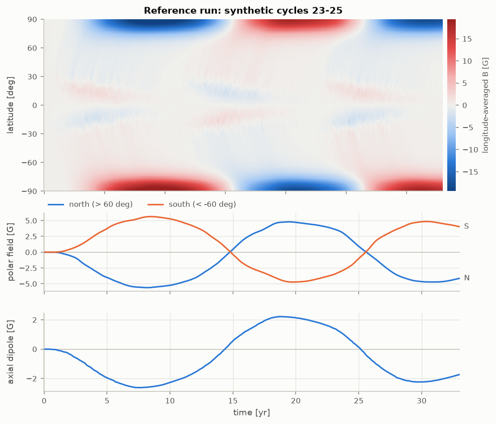

# SFT Solar Pipeline

[](https://github.com/Shivansh1240/sft-solar-pipeline/actions/workflows/ci.yml)

A finite-volume **Surface Flux Transport (SFT)** solver for the Sun's large-scale radial
magnetic field. It evolves bipolar magnetic regions (BMRs) under meridional flow, supergranular
diffusion, differential rotation and optional decay, and tracks the polar fields and axial dipole
that seed the next solar cycle.

Developed at the School of Physical Sciences, NISER Bhubaneswar, under the guidance of
Prof. B. B. Karak (IIT Varanasi), in connection with ongoing work on solar-cycle prediction
and hemispheric asymmetry (Karak, Mishra & Sreedevi 2026, *MNRAS*).

## Results at a glance

Full report with every number and figure: **[`results/REPORT.md`](results/REPORT.md)**
(regenerate with `python benchmarks/run_benchmarks.py`).

| Check | Result |
|---|---|
| Verification checks with exact answers | **16 / 16 pass** |
| Signed-flux conservation (1-D and 2-D) | to round-off (~1e-15 relative) |
| Time accuracy, SSP2 / ARS2 / IMEX-Euler | order **1.97 / 1.99 / 1.01** |
| Space accuracy (diffusion, full operator, steady state, 2-D harmonic) | order **2.00 / 2.02 / 2.12 / 2.00** |
| 11-year 1-D run, 180 cells | **0.29 s** (previous code: ~75 s) |
| 1-year 2-D run, 180 x 360 cells | **2.2 s** (previous code: ~630 s at 90 x 180) |

<p align="center">
  
  
</p>
<p align="center">
  
</p>

## Installation

```bash
git clone https://github.com/Shivansh1240/sft-solar-pipeline.git
cd sft-solar-pipeline
pip install -e ".[plot]"        # numpy, scipy, matplotlib
pip install -e ".[dev]"         # + pytest and ruff
```

Python 3.10 or newer.

## Quick start

### Command line

```bash
sft verify                       # run all 16 verification checks (~12 s)
sft run --cycles 3 --first-cycle 23 --tau 5 --plot run.png --out run.npz
sft run --catalogue my_bmrs.csv --n-lat 180 --tau 5 --plot run.png
sft run --n-lon 360 --cycles 1   # 2-D run (stores longitude averages)
```

### Python

```python
import numpy as np
from sft import Grid, SFTModel, TransportParams, SyntheticCycle, generate_cycles

grid = Grid(n_lat=180)                                   # 1-D, longitude-averaged
params = TransportParams(eta_km2s=500, u0_ms=12.5, tau_yr=5.0)
model = SFTModel(grid, params, dt_days=1.0)              # SSP2 + van Leer by default

events = generate_cycles(SyntheticCycle(cycle=23, n_bmr=2000), n_cycles=2, seed=1)
result = model.run(np.zeros(grid.n_lat), t_end_yr=22.0, events=events)

result.dipole()          # axial dipole moment [G] at each snapshot
result.polar_fields()    # (north, south) mean field poleward of 60 deg [G]
result.butterfly()       # (n_lat, n_time) map
```

A 2-D run only needs a longitude count: `Grid(180, 360)`. Observed emergences load from CSV with
`sft.load_catalogue(path)` (columns `time_yr, lat_deg, flux_mx, tilt_deg` plus either
`leading_sign` or `cycle`; optional `lon_deg, sep_deg, width_deg`).

**Ensembles.** A 1-D state may have shape `(n_lat, k)`: each column is an independent member, and
each BMR goes to the column given by its `member` field. Two hundred 11-year members run in one
vectorised call (see `section_ensemble` in `benchmarks/run_benchmarks.py`).

## The model

For the radial field B(lat, lon, t), in the frame rotating at the Carrington rate:

```
dB/dt = - Omega(lat) dB/dlon                                   differential rotation
        - 1/(R cos lat) d/dlat [ u(lat) cos(lat) B ]           meridional flow
        + eta/(R^2 cos lat) d/dlat [ cos(lat) dB/dlat ]        diffusion in latitude
        + eta/(R^2 cos^2 lat) d^2B/dlon^2                      diffusion in longitude
        - B / tau                                              optional decay
        + S(lat, lon, t)                                       flux emergence
```

| Ingredient | Default | Options |
|---|---|---|
| Meridional flow | u0 sin(2 lat), u0 = 12.5 m/s | `sin_cutoff`: u0 sin(pi lat / 75 deg) inside 75 deg; any callable |
| Diffusivity | 500 km^2/s | any value, including 0 |
| Decay | off (`tau_yr=None`) | any time scale |
| Differential rotation (2-D) | Snodgrass & Ulrich (1990): 0.18 - 2.396 sin^2 - 1.787 sin^4 deg/day | any (A, B, C), or `None` |
| BMR shape | 2-D: van Ballegooijen et al. (1998); 1-D: a pair of Gaussian rings | separation, width |
| Joy's law | tilt = 32.1 deg sin(lat) (Stenflo & Kosovichev 2012) | amplitude, Gaussian scatter |
| Hale's law | odd cycles: northern leading polarity positive | explicit `leading_sign` |
| Cycle profile | Hathaway et al. (1994), b = 56 months, c = 0.8 | all parameters |

### Numerics

- **Grid.** Cells uniform in latitude, with the outer faces exactly on the poles. Because
  cos(lat) = 0 there, no flux crosses the poles: no ghost cells or pole boundary conditions are
  needed, and the total signed flux is conserved to round-off.
- **Advection.** Finite-volume MUSCL reconstruction with a van Leer limiter (also `minmod`, `mc`,
  `none`, `upwind`), treated explicitly. The run refuses a time step with Courant number above 1;
  keep it at or below 0.5 to retain the limiter's positivity guarantee (`model.cfl`).
- **Diffusion and decay.** Treated implicitly. In 2-D the field is Fourier-transformed in
  longitude, so each mode needs one tridiagonal solve; all modes are factorised once per run.
- **Differential rotation.** Applied exactly as a phase shift of each Fourier mode, split
  symmetrically (Strang) around each step, so it imposes no time-step limit and adds no damping.
- **Time stepping.** `ssp2`: SSP2(2,2,2) of Pareschi & Russo (2005), the default because its
  explicit part is strong-stability-preserving. `ars2`: ARS(2,2,2) of Ascher, Ruuth & Spiteri
  (1997), stiffly accurate and 14-27 % cheaper than SSP2 for the same error on the
  accuracy-versus-cost test, but without that guarantee. `euler`: first-order IMEX Euler, kept as a baseline.

## Verification

`sft verify` and `pytest` run the same named checks (`src/sft/verification.py`), each against a
known answer:

- flux conservation in 1-D and 2-D, for every scheme;
- temporal order of each scheme against a fine-step reference;
- spatial order for Legendre-mode diffusion, an exact advection-diffusion steady state, a
  manufactured solution that exercises every term at once, and a 2-D spherical harmonic;
- exact exponential decay, exact differential rotation, and agreement between the 1-D solver and
  the longitude average of the 2-D solver;
- positivity under pure advection;
- physics signs: a Joy-tilted, Hale-ordered BMR pushes the dipole the right way in each
  hemisphere and cycle, and two synthetic cycles reverse the polar field.

CI (GitHub Actions) runs linting, the test suite on Python 3.10 to 3.13, the full verification
suite, and a quick benchmark whose report is attached to every run.

## What the results say (and do not say)

- **The decay term is not a detail.** Starting from zero field with identical BMRs, the dipole
  reverses in cycle 24 with tau = 5 or 10 yr but **not at all without decay**. Conclusions about
  cycle-to-cycle polar fields depend on tau (or an equivalent mechanism) as much as on eta or u0.
- **Faster meridional flow gives a weaker dipole** (17 m/s: -1.79 G versus 8 m/s: -2.05 G at the
  end of cycle 23), as expected from flux being swept poleward before cross-equatorial cancellation.
- **BMR flux heterogeneity matters for forecasts.** For cycle 24, the ensemble spread of the final
  dipole is +/-0.03 G from random emergence alone, +/-0.16 G with 15 deg tilt scatter, and
  +/-0.29 G once BMR fluxes follow a lognormal distribution with the same mean. Equal-flux
  synthetic cycles understate the uncertainty.
- **Not validated against observations.** The verification shows the equations are solved
  correctly; it does not show the parameters or synthetic sources match the Sun. Amplitudes in
  the reference run (dipole about +/-2 G, polar fields about +/-4.5 G) are a behavioural check,
  not a fit.

## Repository layout

```
src/sft/
  grid.py           finite-volume grid (faces on the poles)
  flows.py          meridional flow profiles, differential rotation
  operators.py      MUSCL advection, implicit diffusion + decay per Fourier mode
  imex.py           SSP2(2,2,2), ARS(2,2,2), IMEX Euler
  model.py          SFTModel, TransportParams, RunResult
  sources.py        BMRs, Hale and Joy laws, synthetic cycles, CSV catalogues
  diagnostics.py    fluxes, axial dipole, polar fields, Legendre spectrum
  analytic.py       exact solutions used for verification
  verification.py   the named checks behind `sft verify` and pytest
  plotting.py       figures (optional matplotlib)
  cli.py            `sft run`, `sft verify`
tests/              pytest suite (56 tests, ~10 s)
benchmarks/         run_benchmarks.py, legacy_baseline.json
results/            REPORT.md, JSON results, figures/
```

## Changes from the previous version

The repository was rebuilt from scratch in October 2026. Problems found in the old code, each
measured before it was removed (details in `benchmarks/legacy_baseline.json`):

- **The time stepper was first order, not second.** The "SSP2(2,2,2)" stage weights were wrong;
  measured temporal order 1.04. It was accurate only because it used a 30-minute step, which made
  an 11-year 1-D run take about 75 s.
- **The spectral reference solver could not represent a dipole.** It evaluated Legendre
  polynomials at cos(lat) instead of sin(lat); round-tripping B = sin(lat) gave about 100 % error.
  The "RK-IMEX vs spectral" validation that used it proved nothing.
- **The "analytic DeVore (1984)" reference is not an exact solution for the flow it used.**
  At beta = 2 the true solution changes shape (decays to 0.765 at 10 deg but 0.816 at 80 deg after
  5 yr, grid-converged) while the formula predicts a uniform 0.838. At the beta = 10 the test
  used, both are nearly static, so the test mainly checked that a steep, almost steady profile is
  held. It also fixed beta = 10 although its u0 and eta imply beta = 17.
- **The Hathaway (1994) cycle profile had been altered** to a different functional form.
- **Much of the code could not run.** `numerics.py`, `diagnostics.py` and the test file
  imported modules by pre-rename names (`sft_physics`, `sft_numerics`, `sft_diagnostics`); both
  scripts hard-coded Windows paths; there was no `pyproject.toml` or `__init__.py`, so the
  documented `pip install -e .` failed.
- **The previous README described files and APIs that did not exist** (`grid.py`, `imex.py`,
  `SFTPipeline`, `StochasticJoyEnsemble(...).run_cycle`, the `tests/test_*.py` suite).

The optional Claude-API "AI analyser" was dropped as it is unrelated to the numerical model; it
remains in the git history (commit `cd3f82e`) if needed.

## Contact

**Shivansh Mishra**, Integrated MSc, School of Physical Sciences, NISER Bhubaneswar
(DAE-DISHA Fellow). GitHub: [@Shivansh1240](https://github.com/Shivansh1240)
