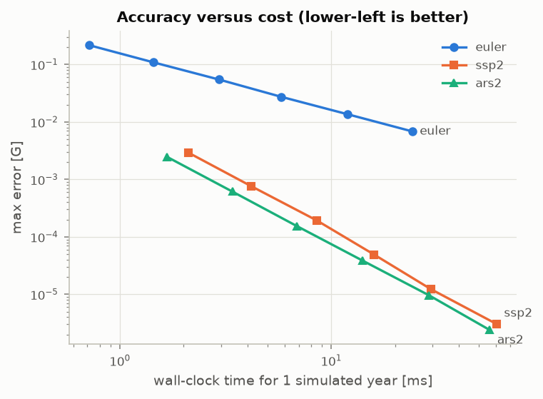
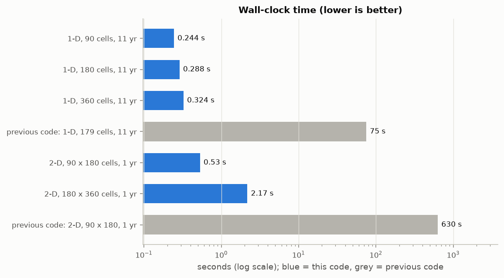
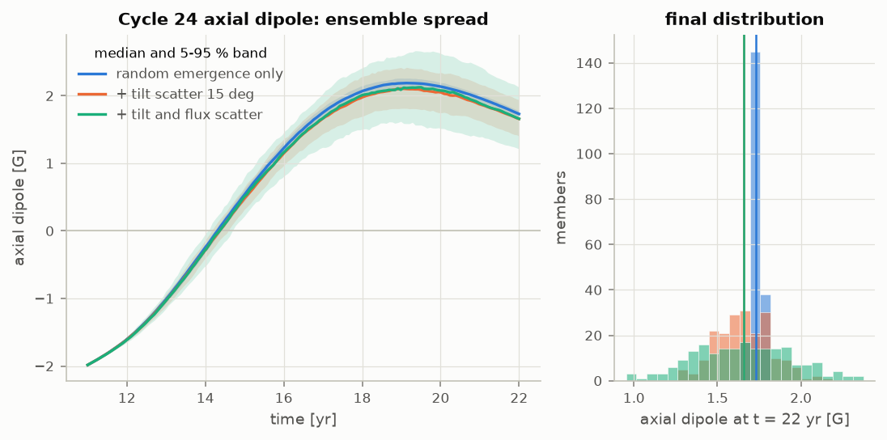
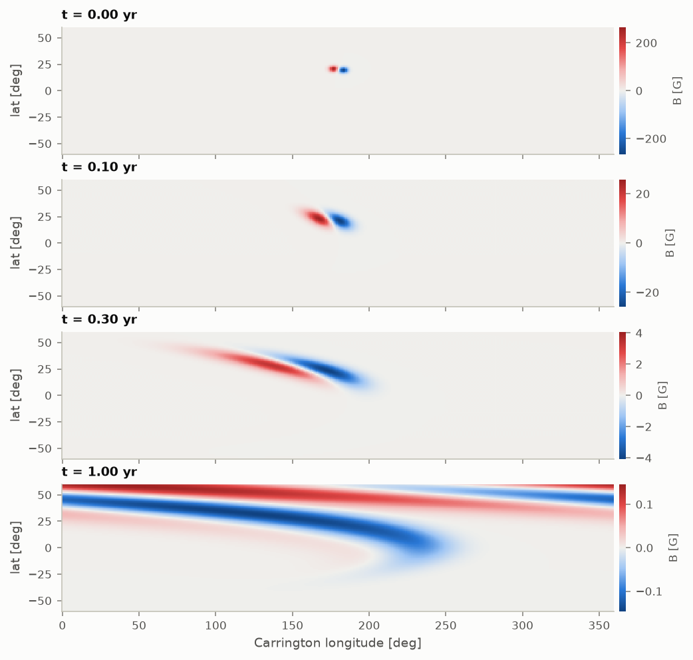

# SFT solver: verification and performance report

Generated by `benchmarks/run_benchmarks.py` on 2026-10-03 (Intel(R) Xeon(R) Processor @ 2.10GHz, 4 cores, Python 3.11.15, NumPy 2.4.6, SciPy 1.17.1). Mode: **full**.

## 1. Verification checks

**16 / 16 passed.** Each check has a known exact answer.

| Check | What is tested | Metric | Value | Pass criterion | Result |
|---|---|---|---|---|---|
| `flux_conservation_1d` | Net flux of a random field under advection + diffusion (no decay), all schemes | max |dPhi| / unsigned flux | 3.57e-15 | < 1e-12 | PASS |
| `flux_conservation_2d` | Net flux of a random 2-D field with differential rotation | max |dPhi| / unsigned flux | 1.35e-17 | < 1e-12 | PASS |
| `dipole_normalisation` | Axial dipole of B = sin(lat) on a 1 degree grid | |D - 1| | 1.27e-05 | < 1e-4 | PASS |
| `exponential_decay` | Uniform field with tau = 5 yr after 5 yr (dt = 1 day) vs exp(-1) | relative error | 1.21e-08 | < 1e-6 | PASS |
| `differential_rotation_exact` | Pure differential rotation for 0.5 yr vs the exact shifted field | max abs error [G] | 8.1e-15 | < 1e-12 | PASS |
| `axisymmetric_consistency` | Longitude average of a 2-D run vs the 1-D run (linear scheme, rotation on) | max relative difference | 5.17e-16 | < 1e-12 | PASS |
| `positivity` | Pure advection of a non-negative top-hat (SSP2 + van Leer, CFL 0.5) | min B / max B0 | -7.88e-65 | >= -1e-12 | PASS |
| `hale_joy_dipole_sign` | A Joy-tilted, Hale-ordered BMR pushes the dipole negative in odd cycles, positive in even cycles, in both hemispheres | dipole of single BMRs [G] | 0.00922 | sign pattern (-,-,+,+) | PASS |
| `polar_reversal` | Two synthetic cycles (23, 24) from zero field, tau = 5 yr: dipole sign alternates | dipole at end of cycle 23, 24 [G] | -1.93 | D(11 yr) < 0 < D(22 yr) | PASS |
| `time_order_ssp2` | Temporal convergence of ssp2 (advection + diffusion + decay, 1 yr, vs dt -> 0) | fitted order | 1.97 | in [1.90, 2.15] | PASS |
| `time_order_ars2` | Temporal convergence of ars2 (advection + diffusion + decay, 1 yr, vs dt -> 0) | fitted order | 1.99 | in [1.90, 2.15] | PASS |
| `time_order_euler` | Temporal convergence of euler (advection + diffusion + decay, 1 yr, vs dt -> 0) | fitted order | 1.01 | in [0.90, 1.15] | PASS |
| `space_order_diffusion` | Diffusion of the Legendre mode P_3 vs exact decay (L-inf) | fitted order | 2 | >= 1.9 | PASS |
| `space_order_mms` | Manufactured solution, full operator with van Leer limiter (L2) | fitted order | 2.02 | >= 1.9 | PASS |
| `space_order_steady_state` | Advection-diffusion steady state for net flux, sin(2 lat) flow (L-inf) | fitted order | 2.12 | >= 1.9 | PASS |
| `space_order_2d_harmonic` | 2-D diffusion of the harmonic P_4^3(sin lat) cos(3 lon) (L-inf) | fitted order | 2 | >= 1.9 | PASS |

## 2. Convergence

| Test | Resolutions | Errors | Fitted order |
|---|---|---|---|
| time, `euler` | dt = 11.4, 5.71, 2.85, 1.43 d | 0.22, 0.11, 0.054, 0.026 | 1.01 |
| time, `ssp2` | dt = 11.4, 5.71, 2.85, 1.43 d | 0.0029, 0.00076, 0.00019, 4.9e-05 | 1.97 |
| time, `ars2` | dt = 11.4, 5.71, 2.85, 1.43 d | 0.0025, 0.00061, 0.00015, 3.9e-05 | 1.99 |
| space, diffusion, P_3 | n_lat = 45, 90, 180, 360 | 0.0014, 0.00036, 9e-05, 2.3e-05 | 2.00 |
| space, full operator, MMS | n_lat = 45, 90, 180, 360 | 0.004, 0.00098, 0.00024, 6e-05 | 2.02 |
| space, advection steady state | n_lat = 45, 90, 180 | 0.0095, 0.0021, 0.0005 | 2.12 |
| space, 2-D harmonic, Y_4^3 | n_lat = 45, 90, 180 | 0.00074, 0.00018, 4.6e-05 | 2.00 |

For comparison, the previous code's 'SSP2(2,2,2)' stepper measured order **1.04** in time on a similar test (see `benchmarks/legacy_baseline.json`); its stage coefficients were wrong.

## 3. Accuracy versus cost

Same problem as the temporal check (1-D, 90 cells, 1 yr). Lower-left is better.

| Scheme | dt [d] | Wall [ms] | Max error [G] |
|---|---|---|---|
| euler | 11.4 | 0.7 | 2.16e-01 |
| euler | 5.71 | 1.4 | 1.09e-01 |
| euler | 2.85 | 2.9 | 5.46e-02 |
| euler | 1.43 | 5.8 | 2.73e-02 |
| euler | 0.713 | 11.9 | 1.37e-02 |
| euler | 0.357 | 24.2 | 6.83e-03 |
| ssp2 | 11.4 | 2.1 | 2.93e-03 |
| ssp2 | 5.71 | 4.2 | 7.58e-04 |
| ssp2 | 2.85 | 8.5 | 1.94e-04 |
| ssp2 | 1.43 | 15.9 | 4.90e-05 |
| ssp2 | 0.713 | 29.6 | 1.23e-05 |
| ssp2 | 0.357 | 60.4 | 3.05e-06 |
| ars2 | 11.4 | 1.7 | 2.46e-03 |
| ars2 | 5.71 | 3.4 | 6.12e-04 |
| ars2 | 2.85 | 6.9 | 1.55e-04 |
| ars2 | 1.43 | 14.0 | 3.87e-05 |
| ars2 | 0.713 | 28.9 | 9.67e-06 |
| ars2 | 0.357 | 56.2 | 2.39e-06 |

## 4. Runtime

SSP2, dt = 1 day, best of repeated runs.

| Case | Steps | Wall [s] |
|---|---|---|
| 1-D, 90 cells, 11 yr | 4018 | 0.244 |
| 1-D, 180 cells, 11 yr | 4018 | 0.288 |
| 1-D, 360 cells, 11 yr | 4018 | 0.324 |
| 2-D, 90 x 180 cells, 1 yr | 366 | 0.53 |
| 2-D, 180 x 360 cells, 1 yr | 366 | 2.17 |
| previous code: 1-D, 179 cells, 11 yr (dt = 30 min) | 192,846 | ~75 |
| previous code: 2-D, 90 x 180 cells, 1 yr (dt = 30 min) | 17,532 | ~630 |

Previous-code timings are extrapolated from shorter runs (see `legacy_baseline.json`). Most of the speed-up comes from the step size: a correct second-order scheme is accurate at dt = 1 day, so the 30-minute step is unnecessary. The rest is vectorisation and a pre-factorised implicit solve.

## 5. Reference solar-cycle run

Three synthetic cycles (23, 24, 25) from zero field: 2000 BMRs per cycle of 3e21 Mx per polarity, Joy tilt 32.1 deg sin(lat), eta = 500 km^2/s, u0 = 12.5 m/s, tau = 5.0 yr, 180 latitude cells. Wall time 1.11 s.

| End of cycle | Axial dipole [G] | North polar field [G] | South polar field [G] |
|---|---|---|---|
| 23 (t = 11.0 yr) | -1.98 | -4.75 | +4.71 |
| 24 (t = 22.0 yr) | +1.74 | +4.16 | -4.07 |
| 25 (t = 33.0 yr) | -1.73 | -4.14 | +4.03 |

Dipole sign changes at t = 14.4, 25.2 yr. These amplitudes come from an uncalibrated synthetic source; they are a consistency check of the model's behaviour, not a fit to observed polar fields.

## 6. Parameter sensitivity

Two cycles from zero field with identical BMRs; one parameter changed at a time.

| Variant | D, end of cycle 23 [G] | D, end of cycle 24 [G] | Dipole reversal in cycle 24 [yr] |
|---|---|---|---|
| reference | -1.96 | +1.74 | 14.4 |
| eta = 250 km^2/s | -1.50 | +1.32 | 14.1 |
| eta = 750 km^2/s | -2.09 | +1.86 | 14.4 |
| u0 = 8 m/s | -2.05 | +1.81 | 14.4 |
| u0 = 17 m/s | -1.79 | +1.58 | 14.4 |
| no decay | -5.43 | -0.07 | no reversal |
| tau = 10.0 yr | -3.20 | +2.11 | 15.7 |

Without a decay term the dipole does not reverse in cycle 24 when starting from zero field: the result depends on tau (or on an equivalent mechanism) as much as on the transport parameters.

## 7. Ensemble spread of the cycle-24 dipole

Cycle 24 started from the end state of a fixed cycle-23 run; each member draws its own BMR times, latitudes and longitudes, with or without Gaussian tilt scatter.

With identical BMR fluxes the spread is small because thousands of equal contributions average out. A lognormal flux distribution (mean flux unchanged) lets a few large regions dominate, which widens the spread. The real distribution is broad, so the equal-flux numbers understate the uncertainty of a dipole forecast.

| Tilt scatter | Flux scatter (ln sigma) | Members | D at start [G] | D at end, mean ± std [G] | 5-95 % [G] | Reversed |
|---|---|---|---|---|---|---|
| 0 deg | 0 | 200 | -1.98 | +1.73 ± 0.03 | +1.69 to +1.78 | 100 % |
| 15 deg | 0 | 200 | -1.98 | +1.66 ± 0.16 | +1.40 to +1.94 | 100 % |
| 15 deg | 1 | 200 | -1.98 | +1.66 ± 0.29 | +1.21 to +2.13 | 100 % |

## 8. 2-D BMR evolution

One Joy-tilted BMR (1e22 Mx per polarity) at 20 deg N on a 180 x 360 grid with Snodgrass & Ulrich (1990) differential rotation, no decay. One year took 2.21 s. The 2-D and 1-D axial dipoles after one year differ by 0.31 % (the van Leer limiter is nonlinear, so averaging in longitude does not commute exactly with the scheme; with a linear scheme the two agree to round-off, see `axisymmetric_consistency`).

## Limitations

- Verification shows the equations are solved correctly; it does not show they match the Sun. No comparison with observed polar fields or magnetograms is included.
- The synthetic source is statistical (Hathaway profile, Joy's law, Hale's law), not a real BMR record. Use `load_catalogue` for observed emergences.
- The 1-D model represents each BMR as a pair of Gaussian rings; it cannot capture non-axisymmetric effects such as BMR-BMR interaction within a longitude band.
- Runtime numbers depend on hardware; ratios are more meaningful than absolute values.

